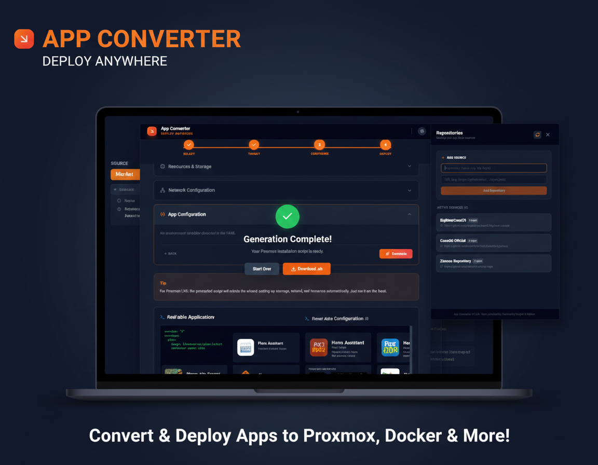

# Deploy Anywhere App Converter

**Deploy Anywhere App Converter** is an advanced Single Page Application (SPA) built with **React**, **TypeScript**, and **Tailwind CSS**. The project streamlines the deployment of containerized applications by transforming third-party repositories (CasaOS, BigBear, ZimoOS) or custom `docker-compose.yaml` files into automated installation scripts for various platforms, with a primary focus on **Proxmox VE (LXC)**.



## 🚀 Core Features

* **Multi-Source Library**: Browse and search apps from CasaOS, BigBear, and ZimoOS repositories.
* **YAML-to-LXC Engine**: Intelligent Docker Compose parser that automatically extracts ports, volumes, environment variables, and commands.
* **Proxmox Automation**: Generates "host-side" Bash scripts that automate LXC container creation, Docker installation, and app deployment (inspired by *Proxmox VE Community Scripts*).
* **Configuration Wizard**: A guided 4-step process using collapsible accordion sections to manage:
    * **Resources**: CPU, RAM, Disk, Storage Pool.
    * **Network**: Static IP/CIDR, Gateway, Bridge.
    * **Environment**: Real-time editing of environment variables and volume paths.
* **Repository Manager**: Slide-in panel to add, remove, or sync new repositories via JSON URLs.
* **Responsive Design**: Mobile-optimized layout with a toggleable sidebar and sticky navigation buttons.

## 📦 Supported Repositories

The application fetches app definitions from the following verified sources:

| Provider | Repository URL | Type |
| :--- | :--- | :--- |
| **CasaOS** | `https://api.github.com/repos/IceWhaleTech/CasaOS-AppStore/contents/Apps` | Official Store |
| **ZimoOS** | `https://api.zimoos.com/v1/appstore/apps` | Hardware Specific |
| **BigBear** | `https://github.com/bigbeartechworld/big-bear-casaos` | Community |
| **Big Bear Runtipi** | `https://github.com/bigbeartechworld/big-bear-runtipi` | Community |
| **BigBear Umbrel** | `https://github.com/bigbeartechworld/big-bear-umbrel` | Community |
| **BigBearCosmos** | `https://github.com/bigbeartechworld/big-bear-cosmos` | Community |
| **BigBearDockge** | `https://github.com/bigbeartechworld/big-bear-dockge` | Community |
| **BigBearPortainer** | `https://github.com/bigbeartechworld/big-bear-portainer` | Community |


## 🛠 Technical Architecture

The project leverages a modern stack focused on execution speed and portability:

* **Frontend**: React 18 with TypeScript.
* **Styling**: Tailwind CSS for a responsive, accordion-based UI.
* **YAML Parsing**: `js-yaml` for programmatic manipulation of compose files.
* **Script Generation**: A dedicated service (`scriptGenerator.ts`) transforms UI configurations into Bash scripts compliant with the `build.func` standard.

### Proxmox Script Logic
Unlike a simple converter, the tool generates a script that:
1.  Validates resources on the Proxmox host.
2.  Allocates the next available VM ID.
3.  Creates the LXC container with specific templates (e.g., Debian 12).
4.  Injects Docker dependencies.
5.  Automatically creates persistent directories on the LXC based on the detected volume mapping.

## 📱 Mobile UX
The design includes specific optimizations for developers operating from mobile devices:
* **Interactive Sidebar**: The app grid is accessible via a "Browse Apps" button that handles the sidebar transition.
* **Sticky Navigation**: *Back* and *Next* buttons are anchored to the bottom of the viewport for seamless wizard completion.

## 🔧 Installation

1.  Clone the repository:
    ```bash
    git clone https://github.com/VisualBoy/Deploy-Anywhere-App-Converter.git
    ```
2.  Install dependencies:
    ```bash
    npm install
    ```
3.  Start the application:
    ```bash
    npm run dev
    ```

## 📄 License

Distributed under the MIT License. See `LICENSE` for more information.

---

**Developer Note**: The script generator uses `\e` escape sequences compatible with `echo -e` to avoid JavaScript parsing errors (`SyntaxError: Invalid octal escape sequence`) when outputting terminal colors.
